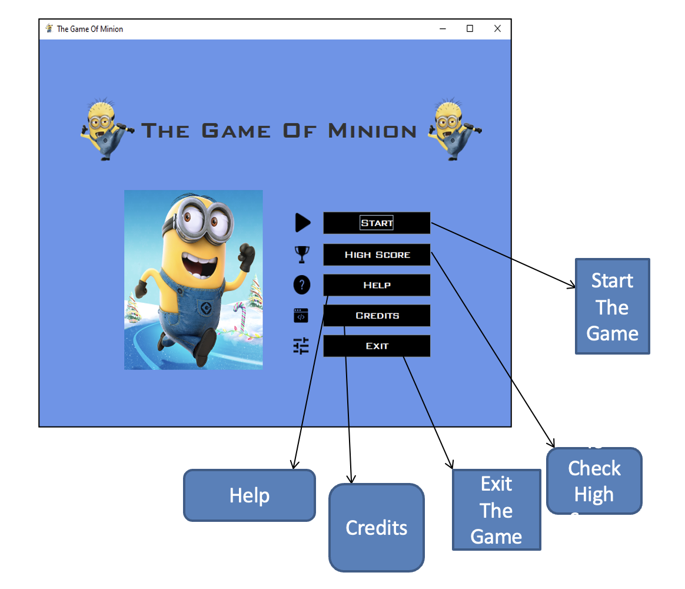

# The Game of Minion
This a java-swing minigame .The player guides a minion across a side-scrolling landscape, avoiding obstacles to achieve a higher score. This is an adventure game. There are total 15 classes of codes. For this project, I have used GUI, filesystem and OOP.

## Game Window

## Requirements:
* Windows/Ubuntu version: Windows 10
* Compiler(with version): Eclipse Java 2019-09
* JDK/JRE: JRE [JavaSE- 12]

## Use Case
- Main/Beginning Window: Main.java
- Files: User.txt, User1.txt
- GUI: Swing

Developer: [Kazi Ramisa Rifa](mailto:kazi.rifa@northsouth.edu)
